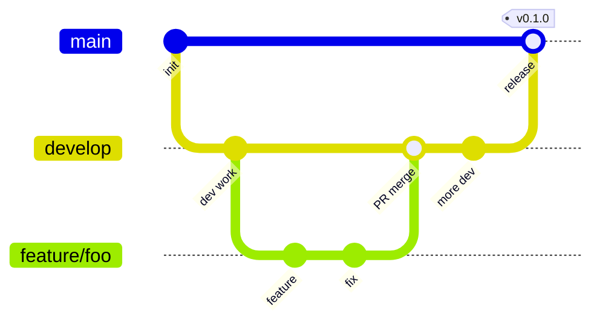
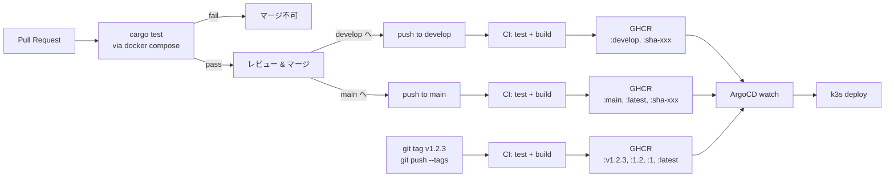

# CI/CD 運用ドキュメント

ai-gateway-rs の継続的インテグレーション・デリバリー設定。

## 概要

- **CI**: PR/push のたびに `cargo test` を docker-compose 経由で実行
- **CD**: developとmainへのpush、および `v*` タグpushで GHCR にイメージpush
- **ターゲットアーキ**: ARM64（Raspberry Pi 4/5 を想定）、`ubuntu-24.04-arm` runner で **ネイティブビルド**（QEMUクロス無し）
- **レジストリ**: `ghcr.io/<owner>/ai-gateway-rs`（public）
- **デプロイ**: ArgoCD + SealedSecret によるGitOps（k3sマニフェストは別リポジトリ）

ワークフロー定義: [`.github/workflows/ci.yml`](../.github/workflows/ci.yml)

## ブランチ運用

| ブランチ | 役割 |
|---|---|
| `feature/*` | 個別の作業ブランチ。`develop` 向けにPRを出す |
| `develop` | デフォルトブランチ。日常開発の統合先＝**ステージング** |
| `main` | **プロダクション**。`develop` から確認済みコミットだけマージ |



## トリガと挙動

| イベント | テスト | GHCR push | 付与されるタグ |
|---|:-:|:-:|---|
| PR (`develop` または `main` がbase) | ✅ | ❌ | - |
| `develop` への push | ✅ | ✅ | `develop`, `sha-<7>` |
| `main` への push | ✅ | ✅ | `main`, `latest`, `sha-<7>` |
| `v*` タグ push | ✅ | ✅ | `v1.2.3`, `1.2.3`, `1.2`, `1`, `latest`, `sha-<7>` |

## フロー図



## リリース手順

### A. 通常開発 (feature → develop)

1. `feature/xxx` ブランチで作業
2. `develop` をbaseにPR作成 → CIでテスト走る
3. レビューOKならマージ → CIが GHCR に `:develop` をpush
4. ArgoCD が `:develop` を watch していれば staging 環境が更新される

### B. プロダクションリリース (develop → main)

1. `develop` で十分検証された状態で、 `main` をbaseにPR作成
2. レビューOKならマージ → CIが GHCR に `:main`, `:latest` をpush
3. ArgoCD が `:main` または `:latest` を watch していれば production が更新される

### C. バージョン固定リリース (リリースノート付き)

1. `main` の最新コミットでタグを切る:
   ```bash
   git checkout main && git pull
   git tag -a v1.2.3 -m "release: 1.2.3"
   git push origin v1.2.3
   ```
2. CIが `:v1.2.3`, `:1.2.3`, `:1.2`, `:1`, `:latest` をpush
3. GitHub UI上で **Releases → Draft a new release** からリリースノート作成（任意）
4. ArgoCD で固定タグ運用してる場合、manifestのimage tagを `v1.2.3` に更新してコミット

## 初回セットアップ (1回限り)

GHCRイメージは初回push時 **private** で作られる。以下で public化する:

1. GitHubのリポジトリ → 右側 **Packages** から `ai-gateway-rs` を開く
2. 右下 **Package settings** → **Change package visibility**
3. **Public** を選択して確認

以降は自動的にpublicが維持される。

## ローカルでCIと同じテストを実行する

```bash
docker compose build test
docker compose run --rm test
```

## 補足

### なぜネイティブARMビルド？

QEMU経由のクロスビルドは Rustコンパイル時間が **2〜5倍遅くなる** 傾向があるため。GitHub-hosted の `ubuntu-24.04-arm` runner は **public リポなら無料** で、Raspberry Pi (ARMv8) と同じ命令セットなのでそのまま走る。

### イメージサイズ

- ベース: `gcr.io/distroless/cc-debian12:nonroot`
- shell / curl / wget なし（攻撃面最小化）
- TLSは `rustls` がバイナリに同梱（OS CA証明書不要）

### キャッシュ戦略

`docker/build-push-action` の `cache-from/to: type=gha` でGitHub Actionsキャッシュ（10GB上限）を使用。`cargo-chef` の依存層 + 本体ビルド層が再利用されるので、依存無変更時は通常 **1〜2分** で完了する想定。
